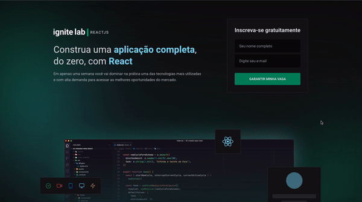

<h1 align='center'>
    
</h1>

<p align="center">Event platform built with ReactJS, Tailwindcss and GraphCMS</p>

<p align="center">
   <a href="https://github.com/gustavonobrega">
    
   </a>
</p>

<p align="center">
  
</p>

<hr />

## 🚀 Technologies

This project was developed with the following technologies:

- [ReactJS](https://reactjs.org/)
- [React Router Dom](https://reactrouter.com/)
- [TypeScript](https://www.typescriptlang.org/)
- [TailwindCSS](https://tailwindcss.com/)
- [GraphQL](https://graphql.org/)
- [Apollo](https://www.apollographql.com/)
- [Codegen](https://www.graphql-code-generator.com/)
- [GraphCMS](https://graphcms.com/)
- [Phosphor Icons](https://phosphoricons.com/)
- [Date-fns](https://date-fns.org/)
- [Vime](https://vimejs.com/)


## 💻  Getting started

_Before you run this application make sure to copy the `.env.example` file, rename it to `.env.local` and add all the values for the environment variables.

```bash
# Clone this repository
$ git clone https://github.com/gustavonobrega/event-platform

# Go into the repository
$ cd event-platform

# Install dependencies
$ npm install

# Run the app
$ npm run dev
```

---

Made with ♥ by Gustavo Nobrega